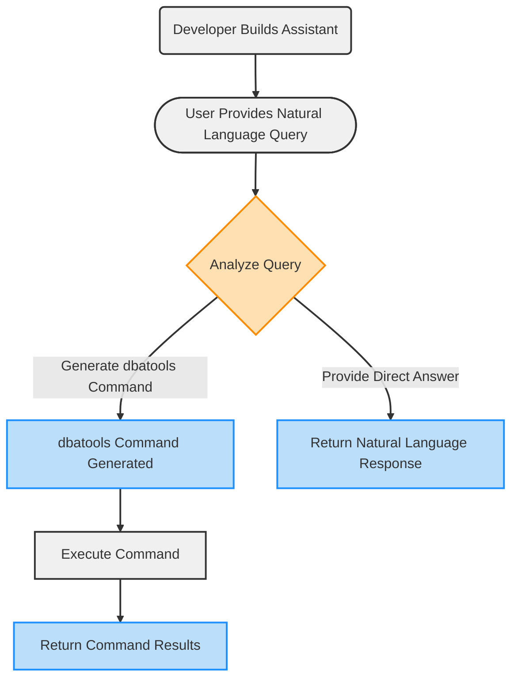
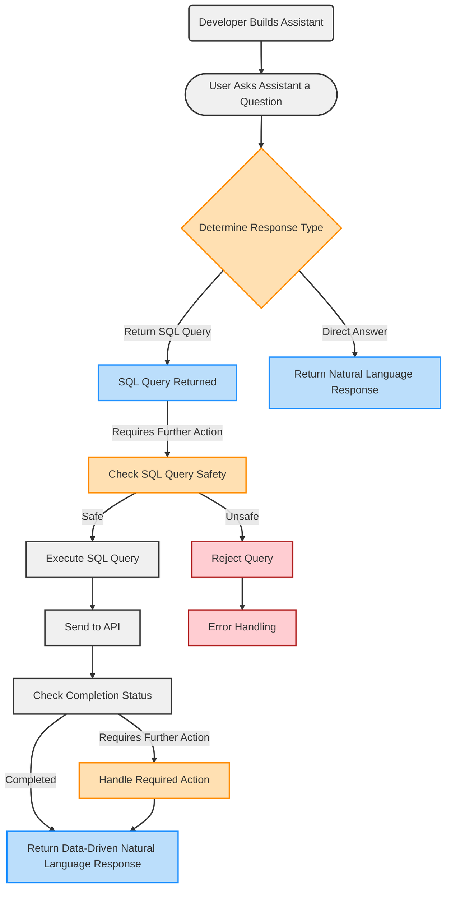

# dbatools.ai: A Copilot for SQL Server Databases

dbatools.ai is a PowerShell module that acts as a helpful assistant for SQL Server databases and dbatools operations. It lets developers and DBAs explore their databases using plain English commands and execute dbatools commands using natural language queries. This project is a proof of concept designed to show PowerShell and .NET developers how to create a database assistant and a dbatools copilot using OpenAI's advanced language models.

It works so well, though. Check this out -- I used the laziest language possible and it still came through.


As a developer, you'll note that building a copilot is not 100% magic. The natural language part is magic, certainly, but it still requires a schema to be provided for database queries. The copilot/OpenAI doesn't magically go in and get that for you. To see how this works, scroll way down to see the workflow.


## Supported Platforms
+ Windows PowerShell 5.1
+ PowerShell 7 or higher
+ Windows, macOS or Linux

## Prerequisites
You need to sign-up for an OpenAI account and generate an API key for authentication. Visit https://platform.openai.com/account/api-keys to create your API key.

Azure OpenAI Services support coming soon.

## Getting Started

To install dbatools.ai, simply run the following command in your PowerShell session:

```powershell
Install-Module dbatools.ai
```
This command will automatically install the required dependencies, including dbatools and PSOpenAI.

Next, set your OpenAI API key as an environment variable:

```powershell
$env:OPENAI_API_KEY = "sk-fake12345FAKE67890APIKEY12345"
```

Now, import the module. You don't always have to do it but sometimes you do if you JUST installed it from the Gallery and it hasn't been indexed.

```powershell
Import-Module dbatools.ai
```

Now, execute your first query. If the Assistant doesn't exist yet, it'll create it automatically. **NOTE**: the module defaults to using Northwind on localhost. This config exists on my local machine so this actually works:

```powershell
dbai what questions can i ask about the database
```
dbai is just a shortcut for `Invoke-DbaiQuery`. Here's how you'd use a database on another server:

```powershell
$parms = @{
    SqlInstance = "sql01"
    Database = "AdventureWerks"
    Message = "Any employee birthdays coming up?"
}

Invoke-DbaiQuery @parms
```

## Usage

dbatools.ai provides several functions to interact with your SQL Server databases:

### Invoke-DbaiQuery

Alias: `dbai`

Executes a natural language query on a specified SQL Server database. This function takes your query, passes it to the OpenAI language model, which determines whether it requires a direct response or a SQL query execution. If a SQL query is needed, the function checks the query's safety and executes it against the database, returning the results.

```powershell
# use defaults to connect to Northwind on localhost
dbai What beverages do we sell?
```

```powershell
$parms = @{
    SqlInstance = "sql01"
    Database = "AdventureWerks"
    Message = "What are the top 5 selling products?"
}

Invoke-DbaiQuery @parms
```

### Invoke-DbatoolsAI

Alias: `dtai`

Executes a natural language query to perform dbatools operations. It utilizes an AI assistant to generate the corresponding dbatools command and executes it.

Currently, only Copy-DbaDatabase is supported.

```powershell
Invoke-DbatoolsAI -Message "Copy the SalesDB database from ServerA to ServerB using the network share \\NetworkPath"

#or

dtai Copy the SalesDB database from ServerA to ServerB using the network share \\NetworkPath
```

### New-DbaiAssistant

Creates a new AI assistant for a specified SQL Server database. The assistant is generated based on the database schema and can be customized with a name, description, and instructions.

Invoke-DbaiQuery automatically executes this if the given assistant hasn't been created yet.

```powershell
Get-DbaDatabase -SqlInstance sql01 -Database AdventureWerks |
New-DbaiAssistant -Name "AdventureWerks AI" -Description "AI assistant for AdventureWerks db"
```

By default, the assistant uses GPT-4o which has a 128k context. That's like 97,000 words so datatypes can easily be included in the schema. If you choose any other model, it'll likely have an 8k context so the module leaves that off when building the instruction string.

### New-DbaiAssistant

This command a new AI assistant for a specified SQL Server database (for `dbai`\`Invoke-DbaiQuery`) or for executing dbatools commands (`dtai`\`Invoke-DbatoolsAI`). The assistant is generated based on the database schema (for database queries) or the context and parameters of dbatools commands (for dbatools operations). It can be customized with a name, description, and instructions.


Invoke-DbatoolsAI automatically creates a dbatools assistant if it doesn't already exist.

```powershell
New-DbaiAssistant

# or with customization
$parms = @{
    Name         = "dbatools"
    Description  = "Copilot for dbatools"
    Instructions = "Translate natural language queries into dbatools commands"
}

New-DbaiAssistant @parms
```

Same with Invoke-DbaiQuery -- it automatically executes this if the given assistant hasn't been created yet.

```powershell
Get-DbaDatabase -SqlInstance sql01 -Database AdventureWerks |
New-DbaiAssistant -Name "AdventureWerks AI" -Description "AI assistant for AdventureWerks db"
```

By default, the assistant uses GPT-4o which has a 128k context. That's like 97,000 words so datatypes can easily be included in the schema. If you choose any other model, it'll likely have an 8k context so the module leaves that off when building the instruction string.


### ConvertTo-DbaiInstruction

Converts the schema of a SQL Server database to a specified format (JSON, SQL, or plain text). This function is used internally by `New-DbaiAssistant` to generate the schema representation for the AI assistant.


```powershell
Get-DbaDatabase -SqlInstance sql01 -Database AdventureWerks | ConvertTo-DbaiInstruction -Type SQL
```

I recommend using plain text as it uses the least amount of tokens.

As mentioned earlier, the assistant uses GPT-4o by default, which has a 128k context. That's like 97,000 words so datatypes can easily be included in the schema. If you choose any other model, it'll likely have an 8k context so the module leaves that off when building the instruction string.

## dtai Workflow

The workflow of `Invoke-DbatoolsAI` can be summarized as follows:

0. You as the devloper build an assistant just once. This assistant is trained to understand and generate dbatools commands.
1. The user provides a natural language query to execute a dbatools command.
2. The assistant analyzes the query and determines the appropriate response type (direct answer or dbatools command).
3. If a dbatools command is required, the assistant generates the corresponding command.
   - The function executes the generated command.
   - The results or output of the command are returned.
4. If a direct answer is sufficient, the assistant returns a natural language response.

Visually, this is what it looks like:



## dbai Workflow

The workflow for `Invoke-DbaiQuery` can be summarized as follows:

0. You build an assistant just once. This assistant contains the schema of your db.
1. The user asks the assistant a question.
2. The assistant determines the appropriate response type (direct answer or SQL query).
3. If a SQL query is required, the function checks the query's safety.
  - If the query is safe, it is executed, and the results are returned.
  - If the query is unsafe, it is rejected, and an error is handled.
4. If a direct answer is sufficient, the assistant returns a natural language response.
5. The function checks the completion status and returns the data-augmented natural language response.

Visually, this is what it looks like



## The Assistant

If you're curious what the assistant actually looks like, this is one that was created for the Northwind db.

```json
{
    "id": "asst_FAKEFGOXz08Rt65w9mKcgwbm",
    "object": "assistant",
    "name": "query-Northwind",
    "description": "Copilot for the Northwind database.",
    "model": "gpt-4o",
    "instructions": "You are an friendly assistant that specializes in translating natural language queries into MSSQL queries. Your task is to analyze the provided database schema, including tables, columns, data types, views, and relationships, and generate the appropriate SQL query based on the user\u0027s natural language input. Ensure that the generated SQL query is optimized, efficient, and accurately retrieves the desired data from the specified database. If the natural language query is ambiguous or lacks necessary information, ask clarifying questions to refine the query.. and a blurb about how to format.",
    "tools": [
        {
            "type": "function",
            "function": {
                "name": "ask_database",
                "description": "Use this function to answer user questions about the database. Input should be a fully formed SQL query.",
                "parameters": {
                    "properties": {
                        "query": {
                            "type": "string",
                            "description": "SQL query extracting info to answer the user\u0027s question. SQL should be written using this database schema:\r\n                                Table: dbo.Categories\nColumns: CategoryID (int) CategoryName (nvarchar) Description (ntext) Picture (image)\n\nTable: dbo.CustomerCustomerDemo\nColumns: CustomerID (nchar) CustomerTypeID (nchar)\nForeign Keys: CustomerTypeID -\u003e dbo.CustomerDemographics(CustomerTypeID), CustomerID -\u003e dbo.Customers(CustomerID)\n\nTable: dbo.CustomerDemographics\nColumns: CustomerTypeID (nchar) CustomerDesc (ntext)\n\nTable: dbo.Customers\nColumns: CustomerID (nchar) CompanyName (nvarchar) ContactName (nvarchar) ContactTitle (nvarchar) Address (nvarchar) City (nvarchar) Region (nvarchar) PostalCode (nvarchar) Country (nvarchar) Phone (nvarchar) Fax (nvarchar)\n\nTable: dbo.Employees\nColumns: EmployeeID (int) LastName (nvarchar) FirstName (nvarchar) Title (nvarchar) TitleOfCourtesy (nvarchar) BirthDate (datetime) HireDate (datetime) Address (nvarchar) City (nvarchar) Region (nvarchar) PostalCode (nvarchar) Country (nvarchar) HomePhone (nvarchar) Extension (nvarchar) Photo (image) Notes (ntext) ReportsTo (int) PhotoPath (nvarchar)\nForeign Keys: ReportsTo -\u003e dbo.Employees(EmployeeID)\n\nTable: dbo.EmployeeTerritories\nColumns: EmployeeID (int) TerritoryID (nvarchar)\nForeign Keys: EmployeeID -\u003e dbo.Employees(EmployeeID), TerritoryID -\u003e dbo.Territories(TerritoryID)\n\nTable: dbo.Order Details\nColumns: OrderID (int) ProductID (int) UnitPrice (money) Quantity (smallint) Discount (real)\nForeign Keys: OrderID -\u003e dbo.Orders(OrderID), ProductID -\u003e dbo.Products(ProductID)\n\nTable: dbo.Orders\nColumns: OrderID (int) CustomerID (nchar) EmployeeID (int) OrderDate (datetime) RequiredDate (datetime) ShippedDate (datetime) ShipVia (int) Freight (money) ShipName (nvarchar) ShipAddress (nvarchar) ShipCity (nvarchar) ShipRegion (nvarchar) ShipPostalCode (nvarchar) ShipCountry (nvarchar)\nForeign Keys: CustomerID -\u003e dbo.Customers(CustomerID), EmployeeID -\u003e dbo.Employees(EmployeeID), ShipVia -\u003e dbo.Shippers(ShipperID)\n\nTable: dbo.Products\nColumns: ProductID (int) ProductName (nvarchar) SupplierID (int) CategoryID (int) QuantityPerUnit (nvarchar) UnitPrice (money) UnitsInStock (smallint) UnitsOnOrder (smallint) ReorderLevel (smallint) Discontinued (bit)\nForeign Keys: CategoryID -\u003e dbo.Categories(CategoryID), SupplierID -\u003e dbo.Suppliers(SupplierID)\n\nTable: dbo.Region\nColumns: RegionID (int) RegionDescription (nchar)\n\nTable: dbo.Shippers\nColumns: ShipperID (int) CompanyName (nvarchar) Phone (nvarchar)\n\nTable: dbo.Suppliers\nColumns: SupplierID (int) CompanyName (nvarchar) ContactName (nvarchar) ContactTitle (nvarchar) Address (nvarchar) City (nvarchar) Region (nvarchar) PostalCode (nvarchar) Country (nvarchar) Phone (nvarchar) Fax (nvarchar) HomePage (ntext)\n\nTable: dbo.Territories\nColumns: TerritoryID (nvarchar) TerritoryDescription (nchar) RegionID (int)\nForeign Keys: RegionID -\u003e dbo.Region(RegionID)\n\nView: dbo.Alphabetical list of products\nColumns: ProductID (int) ProductName (nvarchar) SupplierID (int) CategoryID (int) QuantityPerUnit (nvarchar) UnitPrice (money) UnitsInStock (smallint) UnitsOnOrder (smallint) ReorderLevel (smallint) Discontinued (bit) CategoryName (nvarchar)\n\nView: dbo.Category Sales for 1997\nColumns: CategoryName (nvarchar) CategorySales (money)\n\nView: dbo.Current Product List\nColumns: ProductID (int) ProductName (nvarchar)\n\nView: dbo.Customer and Suppliers by City\nColumns: City (nvarchar) CompanyName (nvarchar) ContactName (nvarchar) Relationship (varchar)\n\nView: dbo.Invoices\nColumns: ShipName (nvarchar) ShipAddress (nvarchar) ShipCity (nvarchar) ShipRegion (nvarchar) ShipPostalCode (nvarchar) ShipCountry (nvarchar) CustomerID (nchar) CustomerName (nvarchar) Address (nvarchar) City (nvarchar) Region (nvarchar) PostalCode (nvarchar) Country (nvarchar) Salesperson (nvarchar) OrderID (int) OrderDate (datetime) RequiredDate (datetime) ShippedDate (datetime) ShipperName (nvarchar) ProductID (int) ProductName (nvarchar) UnitPrice (money) Quantity (smallint) Discount (real) ExtendedPrice (money) Freight (money)\n\nView: dbo.Order Details Extended\nColumns: OrderID (int) ProductID (int) ProductName (nvarchar) UnitPrice (money) Quantity (smallint) Discount (real) ExtendedPrice (money)\n\nView: dbo.Order Subtotals\nColumns: OrderID (int) Subtotal (money)\n\nView: dbo.Orders Qry\nColumns: OrderID (int) CustomerID (nchar) EmployeeID (int) OrderDate (datetime) RequiredDate (datetime) ShippedDate (datetime) ShipVia (int) Freight (money) ShipName (nvarchar) ShipAddress (nvarchar) ShipCity (nvarchar) ShipRegion (nvarchar) ShipPostalCode (nvarchar) ShipCountry (nvarchar) CompanyName (nvarchar) Address (nvarchar) City (nvarchar) Region (nvarchar) PostalCode (nvarchar) Country (nvarchar)\n\nView: dbo.Product Sales for 1997\nColumns: CategoryName (nvarchar) ProductName (nvarchar) ProductSales (money)\n\nView: dbo.Products Above Average Price\nColumns: ProductName (nvarchar) UnitPrice (money)\n\nView: dbo.Products by Category\nColumns: CategoryName (nvarchar) ProductName (nvarchar) QuantityPerUnit (nvarchar) UnitsInStock (smallint) Discontinued (bit)\n\nView: dbo.Quarterly Orders\nColumns: CustomerID (nchar) CompanyName (nvarchar) City (nvarchar) Country (nvarchar)\n\nView: dbo.Sales by Category\nColumns: CategoryID (int) CategoryName (nvarchar) ProductName (nvarchar) ProductSales (money)\n\nView: dbo.Sales Totals by Amount\nColumns: SaleAmount (money) OrderID (int) CompanyName (nvarchar) ShippedDate (datetime)\n\nView: dbo.Summary of Sales by Quarter\nColumns: ShippedDate (datetime) OrderID (int) Subtotal (money)\n\nView: dbo.Summary of Sales by Year\nColumns: ShippedDate (datetime) OrderID (int) Subtotal (money)\n\r\n                                The query should be returned in plain text, not in JSON."
                        }
                    },
                    "type": "object",
                    "required": [
                        "query"
                    ]
                }
            }
        },
        {
            "type": "function",
            "function": {
                "name": "examine_sql",
                "description": "Check if a SQL query is valid and if potentially dangerous.",
                "parameters": {
                    "properties": {
                        "danger_reason": {
                            "type": "string",
                            "description": "If the query is dangerous, why?"
                        },
                        "dangerous": {
                            "type": "boolean",
                            "description": "Does this sql query modify data or is it potentially dangerous?"
                        },
                        "valid_sql": {
                            "type": "boolean",
                            "description": "Is this a valid SQL statement?"
                        }
                    },
                    "type": "object",
                    "required": [
                        "dangerous",
                        "valid_sql"
                    ]
                }
            }
        }
    ],
    "top_p": 1.0,
    "temperature": 1.0,
    "tool_resources": {},
    "metadata": {},
    "response_format": "auto",
    "created_at": "\/Date(1919296032000)\/"
}
```

And this for `Invoke-DbatoolsAI`

```json
{
    "id": "asst_OSa9f4AxMtHD5oJxV0RbVnGb",
    "object": "assistant",
    "name": "dbatools",
    "description": "Copilot for dbatools.",
    "model": "gpt-4o",
    "instructions": "You are a friendly assistant that specializes in translating natural language queries into dbatools commands. Your task is to analyze the provided information, including the context of the command, required parameters, and optional settings, and generate the appropriate dbatools command based on the user\u0027s natural language input. Ensure that the generated command is optimized, efficient, and accurately performs the desired action. If the natural language query is ambiguous or lacks necessary information, ask clarifying questions to refine the command.\r\n\r\nTranslate natural language queries into dbatools commands. Never display the command to the user, only provide it via the function call.\r\n\r\n**Important Instructions:**\r\n1. Output all responses in plain text format only.\r\n2. Do not use markdown formatting of any kind.\r\n3. Avoid using backticks (` `), asterisks (`*`), underscores (`_`), or any other special characters used for markdown.\r\n4. Provide examples and clarifications as plain text without any bullet points, numbering, or other formatting.\r\n5. Do not display a dbatools command to the user unless asked by the user.\r\n6. Never assume the location of the network share. There are no default network shares.\r\n\r\nExample of desired output:\r\nYou can ask a variety of questions to execute dbatools commands, including but not limited to:\r\n\r\nDatabase Migration:\r\n- Copy the database named \"SalesDB\" from server \"ServerA\" to server \"ServerB\" using the network share \"\\\\NetworkPath\".\r\n- Copy all databases from a source server to a destination server.\r\n\r\nExample of undesired output:\r\nYou can ask a variety of questions to execute dbatools commands, including but not limited to:\r\n\r\n1. **Database Migration:**\r\n   - Copy the database named \"SalesDB\" from server \"ServerA\" to server \"ServerB\" using the network share \"\\\\NetworkPath\".\r\n   - Copy all databases from a source server to a destination server.\r\n   - Perform a detach and attach method for copying databases.\r\n\r\n2. **Database Backup:**\r\n   - Back up a specific database.\r\n   - Back up all databases on a server.\r\n   - Perform a differential backup.\r\n\r\nHere is an example of how the assistant can convert a natural language query into a dbatools command:\r\n\r\nUser Input:\r\nCopy the database named \"SalesDB\" from server \"ServerA\" to server \"ServerB\" using the network share \"\\\\NetworkPath\".\r\n\r\nIf you need further clarification or additional information to generate the command, ask questions like:\r\n- Do you want to copy all databases or specific ones?\r\n- Do you want to use the detach and attach method for the copy operation?\r\n",
    "tools": [
    {
        "type": "function",
        "function": {
            "name": "copy_database",
            "description": "Migrate one or more SQL Server databases to another server.",
            "parameters": {
                "properties": {
                    "Source": {
                        "type": "string",
                        "description": "What is the source server name?"
                    },
                    "SharedPath": {
                        "type": "string",
                        "description": "What is the network share/shared path/directory to use for the copy?"
                    },
                    "WhatIf": {
                        "type": "boolean",
                        "description": "Does the user want to see what would happen without actually doing it? Or just wonder what would happen?"
                    },
                    "UseLastBackup": {
                        "type": "boolean",
                        "description": "Do they just want to use the last backup instead of a sharedpath?"
                    },
                    "Destination": {
                        "description": "What is the destination server name?",
                        "items": {
                            "type": "string"
                        },
                        "type": "array"
                    },
                    "AllDatabases": {
                        "type": "boolean",
                        "description": "Do they want all databases to be copied?"
                    },
                    "Force": {
                        "type": "boolean",
                        "description": "Do they want to force the copy? No cares, just go for it."
                    },
                    "DetachAttach": {
                        "type": "boolean",
                        "description": "Did they ask to detach and attach the database?"
                    },
                    "Database": {
                        "description": "What is the name of the database(s) to copy?",
                        "items": {
                            "type": "string"
                        },
                        "type": "array"
                    }
                },
                "type": "object",
                "required": [
                "Source",
                "Destination"
                ]
            }
        }
    }
    ],
    "top_p": 1.0,
    "temperature": 1.0,
    "tool_resources": {

    },
    "metadata": {

    },
    "response_format": "auto",
    "created_at": "\/Date(2116379056000)\/"
}
```

## Limitations and Considerations

This module is a proof of concept and should not be run in prod.
